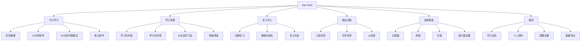
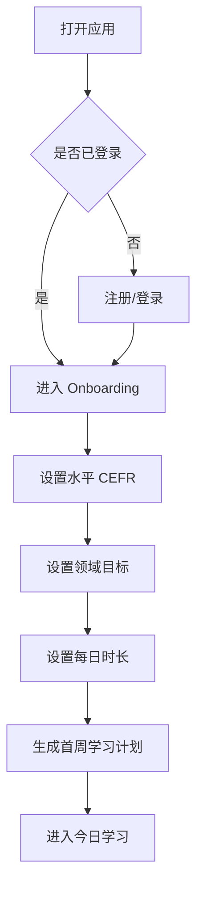
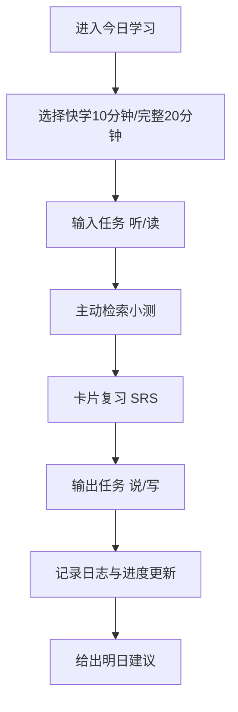
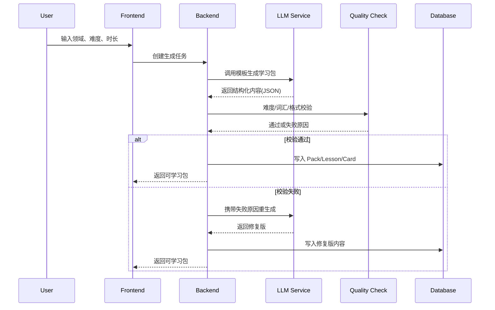
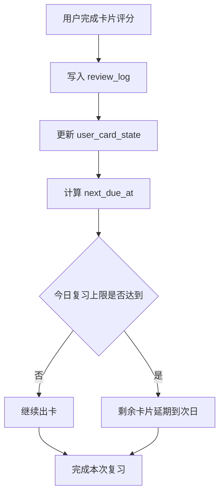

# English Anywhere Lab - 页面信息架构（IA）与关键流程图

## 1. 信息架构（IA）

### 1.1 顶层导航
- 今日学习
- 学习资源
- 复习中心
- 输出训练
- 进度看板
- 我的（设置/目标/账户）

### 1.2 站点地图（Sitemap）

## 2. 关键流程 1：首次进入与计划生成

## 3. 关键流程 2：每日学习闭环

## 4. 关键流程 3：AI 学习包生成与上架

## 5. 关键流程 4：复习调度

## 6. 页面清单（MVP）
- P01 登录与初始化页
- P02 今日学习页
- P03 学习包列表与详情页
- P04 复习中心页
- P05 输出任务页
- P06 进度看板页
- P07 我的与设置页

## 7. 响应式断点建议
- Mobile：`< 768px`
- Tablet：`768px - 1023px`
- Desktop：`>= 1024px`

## 8. 交互优先级建议
- 优先保证“今日学习”和“复习中心”一跳可达
- 次优先保证“学习包生成”和“进度看板”可发现性
- 首版弱化复杂筛选，优先保留目标导向推荐
