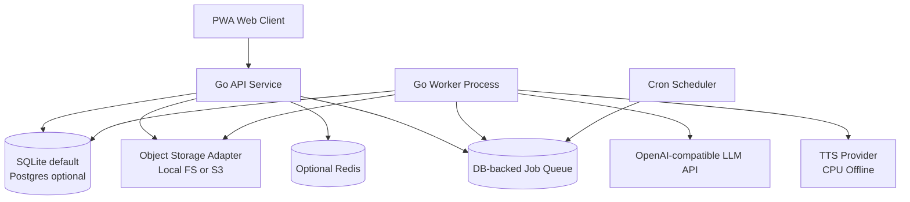

# English Anywhere Lab - Go 后端系统架构（MVP）

## 1. 文档目标
本文件定义后端可直接实施的系统架构，约束 Go 服务边界、部署方式、关键配置、异步任务链路与观测规范。

适用范围：MVP 到 V1（单团队、低并发、个人/小规模用户）。

## 2. 架构原则
- 单体优先：先用模块化单体（Modular Monolith），避免过早微服务化。
- 低成本优先：默认单机部署即可运行全链路。
- 强契约优先：前后端通过 OpenAPI 契约并行开发。
- 可替换优先：数据库、对象存储、LLM provider、TTS provider 均通过接口抽象实现。

## 3. 总体拓扑


## 4. 运行形态

### 4.1 默认（推荐）
- 一个代码仓库，两个可执行入口：
  - `cmd/api`：HTTP API
  - `cmd/worker`：异步任务处理
- SQLite 作为主数据库（WAL 模式）
- 本地文件系统作为对象存储

### 4.2 可选增强
- 切换 Postgres（仅需配置项变更）
- 切换 S3 兼容对象存储（MinIO / AWS S3 / Cloudflare R2）
- 通过 Redis 增强缓存与分布式锁（非必需）

## 5. 代码结构建议（Go）
```text
english-anywhere-lab/
  cmd/
    api/
      main.go
    worker/
      main.go
  internal/
    app/
      bootstrap.go
      config.go
    auth/
    plan/
    review/
    pack/
    tts/
    progress/
    sync/
    llm/
    storage/
    scheduler/
    job/
    db/
      migrations/
      queries/
    transport/
      http/
        handler/
        middleware/
        dto/
    observability/
  api/
    openapi.yaml
```

## 6. 模块职责
- `auth`：注册登录、令牌签发、会话管理。
- `plan`：今日学习计划生成、任务编排、断点续学。
- `review`：复习队列、评分提交、状态推进。
- `scheduler`：FSRS 调度与策略参数。
- `pack`：学习包查询、AI 生成任务发起与写库。
- `tts`：离线音频生成、对象存储落盘、`cards.audio_url` 回填。
- `sync`：离线事件上报与冲突处理。
- `progress`：聚合统计、周报月报。
- `llm`：统一 LLM provider 适配层。
- `storage`：本地/S3 文件存储适配层。
- `job`：异步任务状态机与执行器。

## 7. 数据流（关键链路）

### 7.1 复习提交链路
1. 客户端提交评分（携带 `idempotency_key`）。
2. `review` 模块校验卡片状态与并发版本。
3. `scheduler` 使用服务端接收时间计算新间隔与下次到期（客户端 `reviewed_at` 仅审计）。
4. 写入 `review_logs` 与 `user_card_states`。
5. 触发 `progress_daily` 异步更新任务。

### 7.2 学习包生成链路
1. 客户端发起生成请求。
2. API 创建 `ai_generation_jobs`（`queued`）。
3. Worker 拉取任务调用 LLM。
4. 做 JSON Schema 校验 + QC 校验。
5. 成功则入库 `resource_packs/lessons/cards/output_tasks`。
6. 任务置 `success` 并返回结果。

### 7.3 TTS 生成链路（离线 CPU）
1. `pack/cards` 成功入库后，创建 `tts generation` 任务。
2. Worker 拉取任务调用本地 TTS provider（默认 `sherpa_onnx`）。
3. 生成音频并写入对象存储（`local|s3`）。
4. 回写 `cards.audio_url`（或对应媒体字段），并记录任务状态。
5. 同文本同参数命中去重键时直接复用已有对象。

## 8. 配置规范（核心）

### 8.1 应用配置
- `APP_ENV=dev|staging|prod`
- `HTTP_ADDR=:8080`
- `LOG_LEVEL=debug|info|warn|error`

### 8.2 鉴权配置
- `JWT_ISSUER`
- `JWT_ACCESS_TTL_MIN=60`
- `JWT_REFRESH_TTL_HOUR=720`
- `JWT_SIGN_KEY`

### 8.3 数据库配置
- `DB_DRIVER=sqlite|postgres`
- `DB_DSN=`
- `SQLITE_PATH=./data/app.db`
- `SQLITE_BUSY_TIMEOUT_MS=5000`
- `SQLITE_WAL=true`

### 8.4 对象存储配置
- `FILES_PROVIDER=local|s3`
- `FILES_LOCAL_ROOT=./data/files`
- `FILES_S3_ENDPOINT=`
- `FILES_S3_REGION=`
- `FILES_S3_BUCKET=`
- `FILES_S3_ACCESS_KEY=`
- `FILES_S3_SECRET_KEY=`
- `FILES_S3_FORCE_PATH_STYLE=true`

### 8.5 LLM 配置
- `LLM_PROVIDER=openai_compatible`
- `LLM_BASE_URL=https://api.openai.com/v1`
- `LLM_API_KEY=`
- `LLM_MODEL=gpt-5.3-codex`（示例，可替换）
- `LLM_API_MODE=responses|chat_completions`
- `LLM_TIMEOUT_SEC=60`
- `LLM_MAX_RETRIES=2`

### 8.6 TTS 配置
- `TTS_ENABLED=true|false`
- `TTS_PROVIDER=sherpa_onnx|piper_cli`
- `TTS_MODEL_DIR=./models/tts/en`
- `TTS_VOICE=en_default_female`
- `TTS_SAMPLE_RATE=22050`
- `TTS_SPEED=1.0`
- `TTS_OUTPUT_FORMAT=wav|mp3`
- `TTS_WORKER_CONCURRENCY=2`
- `TTS_RETRY_MAX=2`

## 9. 并发与一致性策略
- 所有写请求必须支持幂等键。
- 对关键写操作使用事务（复习提交、计划推进）。
- SQLite 场景使用短事务和重试，避免长写锁。
- Worker 通过 `SELECT ... FOR UPDATE`（Postgres）或“状态原子更新”方式抢任务。

## 10. 安全与隐私
- 密码仅存 hash（Argon2id 或 bcrypt）。
- API 统一鉴权中间件与 RBAC（MVP 可简化为 user-only）。
- 文件上传限制类型与大小（白名单）。
- 关键日志脱敏：邮箱、token、文本答案。

## 11. 可观测性
- 日志：结构化 JSON 日志（trace_id, user_id, route, latency_ms）。
- 指标：请求延迟、错误率、队列积压、任务成功率、LLM 花费、TTS 成功率与时延。
- 追踪：可选 OpenTelemetry（MVP 可先日志 + metrics）。

## 12. 非功能目标（MVP）
- API P95 < 800ms（不含 LLM）
- 任务执行成功率 >= 98%
- 可用性 >= 99.5%

## 13. 开发落地建议
1. 先按 OpenAPI 生成 handler stub。
2. 实现 `review` 与 `plan` 两个核心域。
3. 接入 DB-backed queue 与 `pack generation` 任务。
4. 接入 `tts generation` 与对象存储回填链路。
5. 最后接入离线同步和周报聚合。
